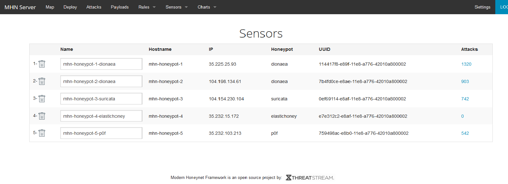
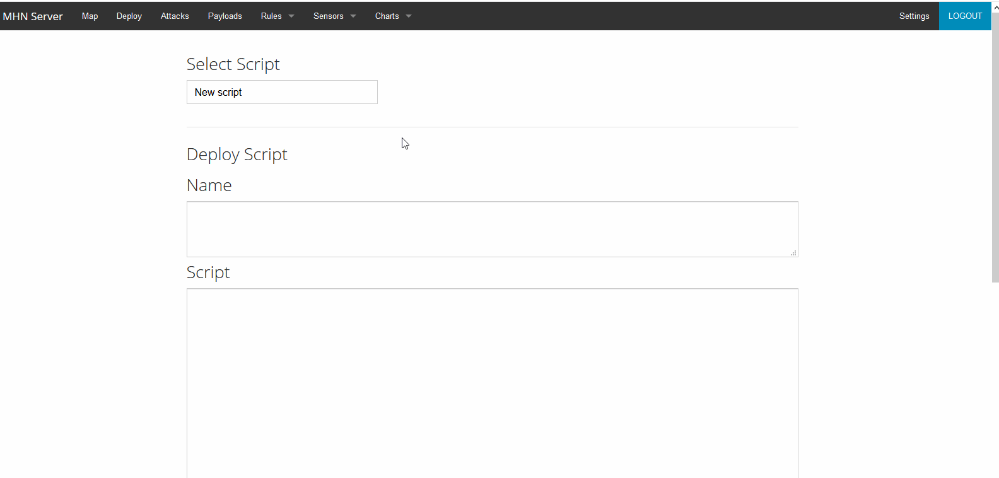

# Week-9-Project-Honeypot
Time Spent: **5** hours spent in total

# Which Honeypot(s) you deployed
I deployed Ubuntu - Dionaea, Ubuntu - Dionaea with HTTP, Ubuntu - Suricata, and Ubuntu - P0f.

# Any issues you encountered
During the installation of the MHN Admin Application, I encountered a repository that either did not exist or was made private. To correct this, I had to do some research and then update the install_hpfeeds.sh file with the correct repository name. 

# A summary of the data collected: number of attacks, number of malware samples, etc.
Instantly after deploying the honeypots, I received serveral attacks. While the honeypots remained up, I received attacks from various countries. Many attacks had a destination port of either 8088 or 80, but there were many other ports that were attacked. Some attackers attacked more than once. In total, I received 3527 attacks.

# Any unresolved questions raised by the data collected
Why are there so many attacks launched against port 8088?
